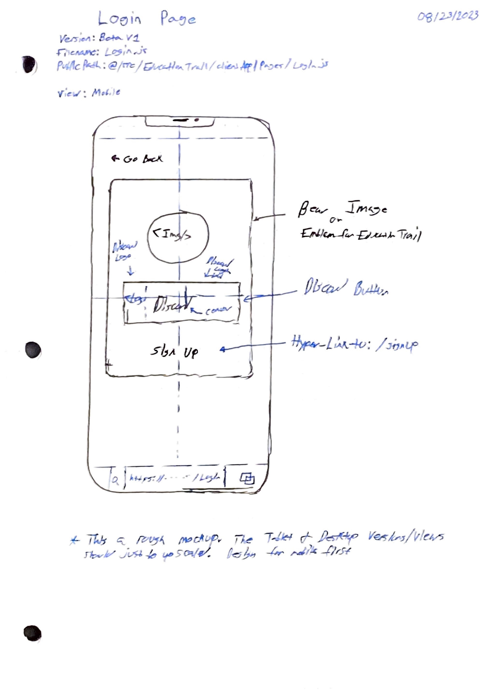

> *Please remeber this documentation is a rough mockup for the above page. It is up to the designer how this mockup should be created in the WebApp*
> *Look at the meta data of this markdown file to find important information*

### Summary

### Requirments


### [**Login**] Page Mockup


### Mockup Notes
*For now the tablet and mobile versions of this mock up should just be upscaled*

### 0Auth2 Flow
```mermaid

```

### 0Auth2 Data Structure

##### Class Graph
```mermaid
```


##### JSON Example
```json
{
}
```

### Our Integration Flow
```mermaid
```
