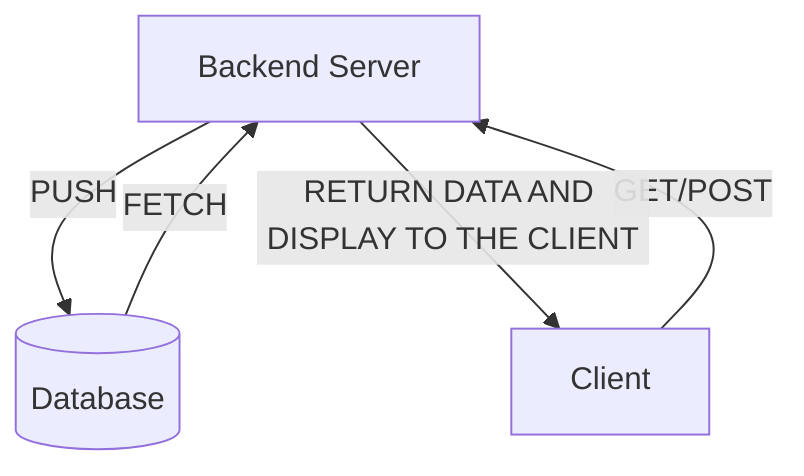

### Back-End Flow

```mermaid
flowchart TD
    sr[Backend Server]
    db[(Database)]
    cl[Client]
    sr-- PUSH -->db
    db-- FETCH -->sr
    cl-- GET/POST -->sr
    sr-- RETURN DATA AND DISPLAY TO THE CLIENT -->cl
```
